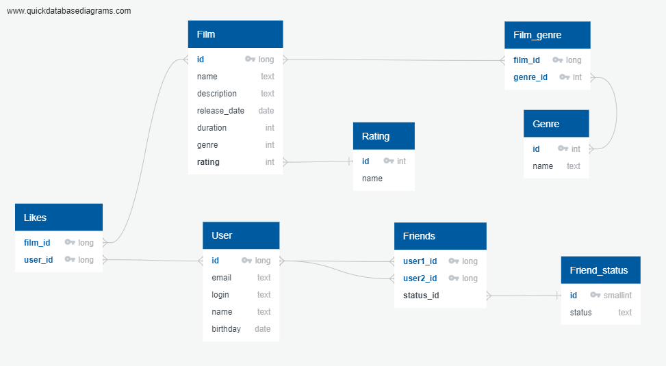

# java-filmorate
Template repository for Filmorate project.

## Структура и описание базы данных


Основные сущности: Film и User представлены соответствующими таблицами в БД, ключем в которых является id.

### Список друзей
Хранение списка друзей реализовано в таблице Friends, в которой использован составной ключ из полей user1_id и user2_id.
Также в таблице фигурирует поле status_id, отражающее состояние заявки в друзья. Если заявка была отклонена то запись удаляется их базы данных.

Сосятоние может быть следующим:
- ACCEPTED (status_id = 1) - если запрос принят;
- UNDER_CONSIDERATION (status_id = 2) - пока по запросу не принято решения.

#### Пример запроса для получения списка друзей пользователя с id = 1
```roomsql
SELECT user2_id AS friends
FROM Friends
WHERE user1_id = 1
      AND status_id = 1
UNION
SELECT user1_id AS friends
FROM Friends
WHERE user2_id = 1
      AND status_id = 1;
```

### Список лайков фильмов
Хранение списка лайков реализовано в таблице Likes, где задан составной ключ из полей film_id и user_id.

#### Пример запроса для получения таблицы с id фильма и соотвествующим ему количесвом лайков
```roomsql
SELECT film_id, 
       COUNT(user_id) AS Likes
FROM Likes
GROUP BY film_id
ORDER BY Likes;
```

#### Пример запроса для получения топ-5 фильмов
```roomsql
SELECT f.name,
       COUNT(l.user_id) AS likes_count
FROM Film AS f
JOIN Likes AS l ON f.id = l.film_id
GROUP BY f.name
ORDER BY likes_count DESC
LIMIT 5;
```

### Список жанров фильма
Хранение жанров реализовано в таблице Film_genre, в которой использован составной ключ из полей film_id и genre_id.

#### Пример запроса для получения списка жанров фильма с id = 1
```roomsql
SELECT g.name AS genre_name
FROM Film_genre AS fg
JOIN Genre AS g ON fg.genre_id = g.id
WHERE fg.film_id = 1;
```