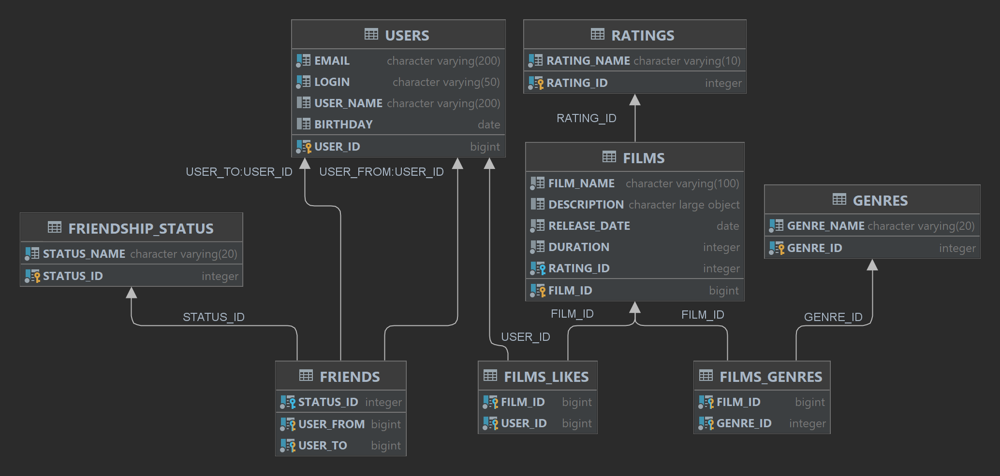

# java-filmorate
Template repository for Filmorate project.

## Структура и описание базы данных


Основные сущности: Film и User представлены соответствующими таблицами в БД, ключем в которых является id.

### Список друзей
Хранение списка друзей реализовано в таблице FRIENDS, в которой использован составной ключ из полей USER-FROM и USER_TO.
Также в таблице фигурирует поле status, отражающее состояние заявки в друзья.

Сосятоние может быть следующим:
- CONFIRMED (status = 1) - если запрос принят;
- UNCONFIRMED (status = 0) - пока по запросу не принято решения.

#### Пример запроса для получения списка друзей пользователя с id = 1
```roomsql
SELECT user_from AS friends
FROM friends
WHERE user_to = 1
      AND status = 1
UNION
SELECT user_to AS friends
FROM friends
WHERE user_from = 1
      AND status = 1;
```

### Список лайков фильмов
Хранение списка лайков реализовано в таблице LIKES, где задан составной ключ из полей FILM_ID и USER_ID.

#### Пример запроса для получения таблицы с id фильма и соотвествующим ему количесвом лайков
```roomsql
SELECT film_id, 
       COUNT(user_id) AS Likes
FROM Likes
GROUP BY film_id
ORDER BY Likes;
```

#### Пример запроса для получения топ-5 фильмов
```roomsql
SELECT f.name,
       COUNT(l.user_id) AS likes_count
FROM Film AS f
JOIN Likes AS l ON f.id = l.film_id
GROUP BY f.name
ORDER BY likes_count DESC
LIMIT 5;
```

### Список жанров фильма
Хранение жанров реализовано в таблице FILMS_GENRES, в которой использован составной ключ из полей FILM_ID и GENRE_ID.

#### Пример запроса для получения списка жанров фильма с id = 1
```roomsql
SELECT g.genre_id, g.genre_name
FROM films_genres AS fg
JOIN genres AS g ON (fg.genre_id = g.genre_id)
WHERE film_id = 1;
```